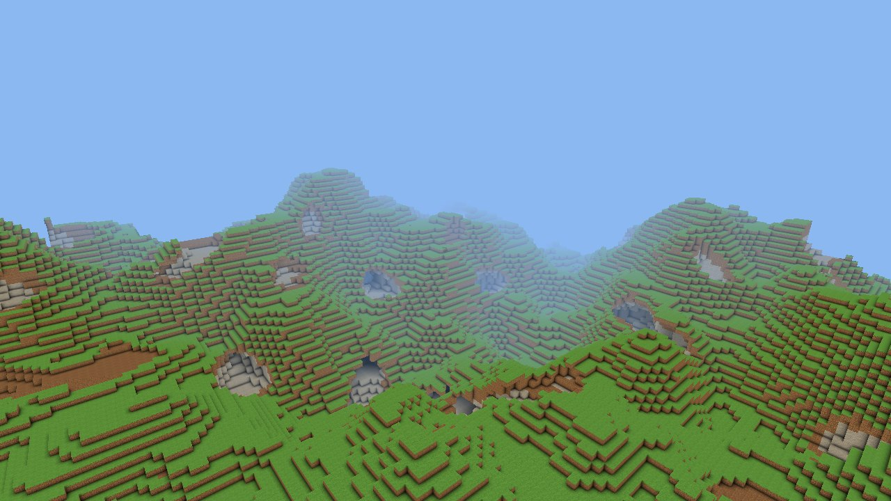
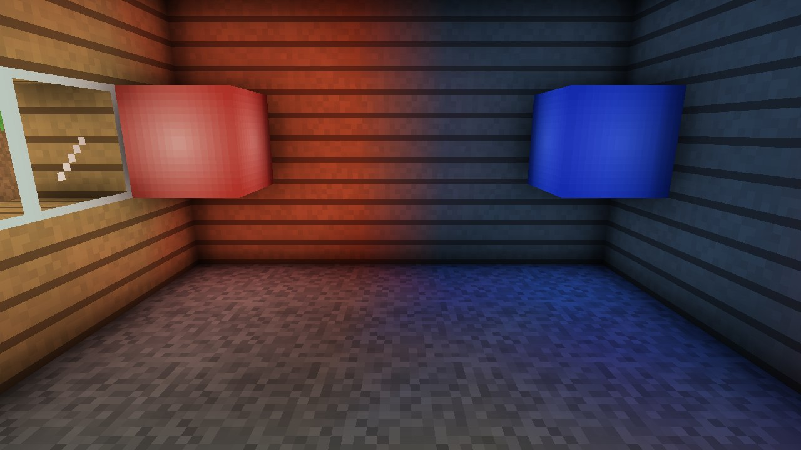
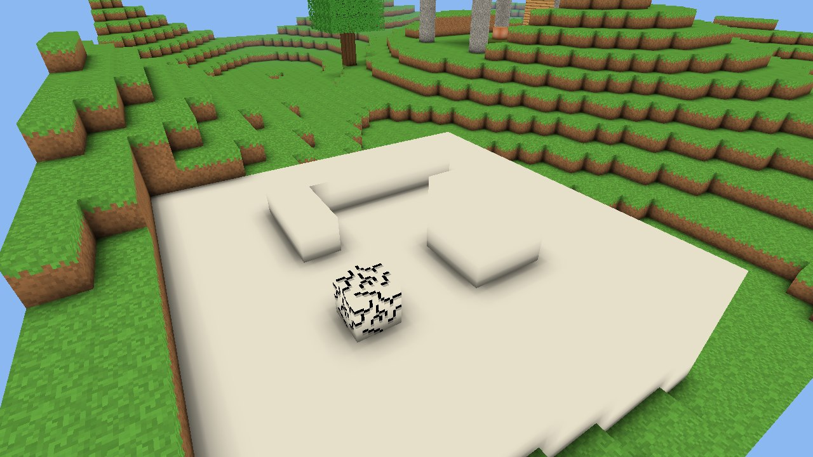
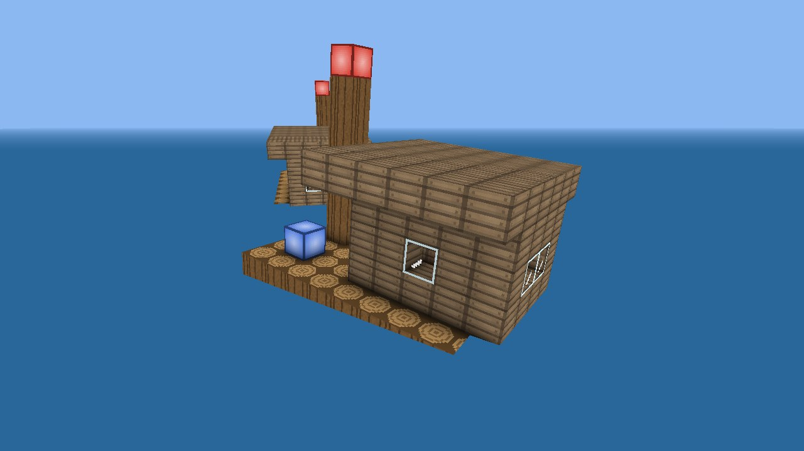

# BlockyMesher

Minecraft-like block worlds for Unity, built on the Job System and Burst. Use it for an endless
terrain that streams in around the player, or for standalone block objects, like a raft, a house or
a 3D drawing, that move and rotate like any other GameObject.

It is made to stay light enough for the web. The heavy work runs in Burst jobs: on worker threads
where the platform has them, and on the main thread within a per-frame time budget where it doesn't.



| Colored light | Ambient occlusion | A raft |
|---|---|---|
|  |  |  |

## Features

- **Two ways to use it.** A `Landscape` on its own is a block object with its own transform. Add a
  `LandscapeStreamer` and it becomes an endless terrain that loads around focus points and drops
  what is left far behind.
- **Jobs and Burst.** Generation, lighting, meshing and colliders are Burst-compiled jobs. They run
  in parallel on worker threads, or on the main thread within a time budget (4 ms by default) when
  there are none.
- **Smooth, colored light.** Skylight and block light from 0 to 7, recomputed with every build and
  never stored. Lamps can use up to 16 colors per registry; where lights overlap, the brightest wins.
  A day/night cycle is a single shader color and never rebuilds a mesh.
- **Prebaked ambient occlusion.** Each of the 256 ways blocks can surround a face is baked into a
  tile once. A mesh only stores which tile each face needs, and the shader draws it.
- **Small meshes.** 12-byte vertices, 16-bit indices where they fit, one submesh per render pass in
  use, and no CPU copy once a mesh is on the GPU.
- **Opaque, cutout and transparent blocks,** textured from a texture array.
- **Edits that survive streaming.** They are kept per section as the differences from the generated
  terrain, or as a compressed copy when a section was reshaped, whichever is smaller. Save them to
  bytes and load them back.
- **Colliders:** merged mesh colliders near the player, or box colliders for a landscape on a
  Rigidbody.
- **Tools:** a voxel raycast, a block-breaking crack overlay, block patterns with a live preview in
  the Scene view, a stats window and an on-screen stats overlay.

## Requirements

- Unity 6.0 or newer, tested on Unity 6.5 (6000.5.11f1).
- The Universal Render Pipeline.
- Burst, Collections and Mathematics, which install with the package.
- The samples also need the Input System package.

## Installation

In **Window > Package Manager**, choose **+ > Install package from git URL…** and enter:

```
https://github.com/reromanlee/BlockyMesher.git?path=/UnityPackage
```

## Quick start

### 1. Blocks

1. Draw the block textures as 16 × 16 tiles in a grid PNG. The samples use a 256 × 256 image, which
   holds a 16 × 16 grid. In its import settings, set **Texture Shape** to **2D Array**, **Columns**
   and **Rows** to the grid size, and **Filter Mode** to **Point**. The tiles become layers,
   counted from 0, left to right and top to bottom.
2. Create a **Block** asset for each block type (**Assets > Create > BlockyMesher > Block**). Give
   each one an id from 1 up (0 is air), and never change it once blocks are placed. Then pick the
   layer each face shows.
3. Create a **Block Registry** (**Assets > Create > BlockyMesher > Block Registry**), list the
   blocks in it and assign the texture array. The inspector lists anything that needs fixing.

### 2a. A standalone object

Add a **Landscape** component and assign the registry. Then fill it from code:

```csharp
using reromanlee.BlockyMesher;
using UnityEngine;

public class RaftBuilder : MonoBehaviour
{
    [SerializeField] Landscape raft;
    [SerializeField] BlockData log, planks, lamp;

    void Start()
    {
        using (raft.BatchEdits())
        {
            raft.Fill(new BoundsInt(0, 0, 0, 9, 1, 6), log);
            raft.Fill(new BoundsInt(4, 1, 1, 5, 3, 4), planks);
            raft.SetBlock(new Vector3Int(1, 1, 1), lamp);
        }
    }
}
```

Or assign a **Block Pattern** to the landscape's **Pattern** field, and it previews in the Scene
view outside Play Mode. To make a pattern, build the blocks in a landscape and click **Save Blocks
as Pattern…** in its inspector, or call `landscape.Export(bounds)` at runtime.

For a small object, set **Sections Per Column** to 1, which makes it 16 blocks tall. For one that
moves on a Rigidbody, set **Colliders** to **Boxes**.

### 2b. An endless terrain

1. Create a **Noise Terrain** step (**Assets > Create > BlockyMesher > Generation > Noise Terrain**)
   and pick its surface, subsurface and stone blocks.
2. Create a **Terrain Generator** (**Assets > Create > BlockyMesher > Terrain Generator**) and add
   the step to it.
3. Add a **Landscape** and a **Landscape Streamer** to a GameObject. Assign the registry and turn on
   **Solid Below World**, which hides the terrain's bottom faces. Assign the generator and add the
   player to **Focus Points**. While that list is empty, the main camera is used.

### Playing with blocks

```csharp
// The block in the middle of the screen: break it, or place a block against it.
Ray ray = playerCamera.ViewportPointToRay(new Vector3(0.5f, 0.5f));
if (landscape.Raycast(ray, 8, out BlockHit hit))
{
    if (breaking)
        landscape.SetBlock(hit.Block, 0); // 0 is air
    else
        landscape.SetBlock(hit.Adjacent, stone);
}

// Save the player's edits anywhere, then load them back. Keep the generator and its seed with them.
byte[] saved = streamer.SaveEdits();
streamer.LoadEdits(saved);

// Night falls. Vertices only store how much sky they see, so no mesh is rebuilt.
BlockLighting.SkyColor = new Color(0.14f, 0.16f, 0.3f);
```

### Your own generation steps

A generator runs its steps in order for every column, and each step sees what the previous ones
wrote. So terrain comes first, and later steps can add caves, trees or structures. A step schedules
a job that fills the column's block ids. This one floods everything below sea level with water:

```csharp
using reromanlee.BlockyMesher;
using Unity.Burst;
using Unity.Collections;
using Unity.Jobs;
using UnityEngine;

[CreateAssetMenu(menuName = "My Game/Sea")]
public sealed class SeaStep : GenerationStep
{
    public BlockData water;
    public int seaLevel = 40;

    public override JobHandle Schedule(ColumnContext column, NativeArray<ushort> blocks, JobHandle dependsOn) =>
        new SeaJob { Water = (ushort)water.id, SeaLevel = seaLevel, Blocks = blocks }.Schedule(dependsOn);

    [BurstCompile]
    struct SeaJob : IJob
    {
        public ushort Water;
        public int SeaLevel;
        public NativeArray<ushort> Blocks;

        public void Execute()
        {
            for (int y = 0; y < SeaLevel; y++)
            for (int z = 0; z < 16; z++)
            for (int x = 0; x < 16; x++)
            {
                int i = ColumnContext.Index(x, y, z);
                if (Blocks[i] == 0)
                    Blocks[i] = Water;
            }
        }
    }
}
```

A step has to be deterministic: the same seed and column must always give the same blocks, because
player edits are stored as differences from them.

## Concepts

- **Blocks** are numbers: `ushort` ids. `BlockData` assets describe them, and a `BlockRegistry`
  bakes them into a table the jobs read. Derive from `BlockData` to add gameplay data of your own.
- **Sections and columns.** A landscape is stored in sections of 16 × 16 × 16 blocks, stacked into
  columns that are **Sections Per Column** tall (16 by default, so 256 blocks). y starts at 0; move
  the GameObject to put the landscape anywhere. A section made of a single kind of block stores
  just one id.
- **Render passes.** Opaque blocks hide the faces they touch and cast ambient occlusion. Cutout
  blocks, like leaves or a glass frame, are drawn or cut away pixel by pixel. Transparent blocks
  blend with what is behind them and draw last.
- **Light.** Skylight comes down each column from the sky, and block light comes from blocks with
  emission. Both spread one level dimmer per block, from 7 down to 0. Light is recomputed whenever a
  section is rebuilt, so there is nothing to save or keep in sync.
- **Floating origin.** Everything is relative to the landscape's transform, so shifting it along
  with the rest of the world just works.

## Performance

Measured in the editor on an Intel Core i7-12700K (20 threads, so the Job System has 19 worker
threads) with Unity 6000.5.11f1. Player builds are usually faster.

**Building one section**: copying the blocks around it, lighting, meshing and uploading the mesh.

| Section | Burst, one at a time | Burst, 19 worker threads | Without Burst |
|---|---|---|---|
| Hills surface | 0.34 ms | 0.06 ms | 1.16 ms |
| Caves | 0.46 ms | 0.11 ms | 1.32 ms |
| Colored lamps | 0.42 ms | 0.07 ms | 1.10 ms |
| Checkerboard, the worst case | 1.73 ms | 0.64 ms | 6.09 ms |

**Generating one column** of 16 × 256 × 16 blocks: 0.20 ms for hills, 0.83 ms with caves.

**An endless terrain at view radius 8**, 256 blocks tall, hills without caves:

- 293 columns, 309 meshes and draw calls, 197k triangles.
- 4.1 MB of blocks and 5.7 MB of meshes.
- While it streams, build buffers add 11 MB. After about 3 idle seconds, they are down to 0.6 MB.

**Streaming in Play Mode** at view radius 6, 256 blocks tall, with a 4 ms budget, flying at 20
blocks per second. The times are the package's main-thread work per frame:

| | First view | Worst frame while loading | Flying, average frame | Flying, worst frame |
|---|---|---|---|---|
| 19 worker threads | 20 frames (0.06 s) | 4.03 ms | 0.08 ms | 0.38 ms |
| No worker threads, like the web without multithreading | 41 frames (0.19 s) | 4.46 ms | 0.08 ms | 1.25 ms |

To measure on your own machine, add `com.reromanlee.blockymesher` to `testables` in
`Packages/manifest.json` and run the **Benchmark** category from the Test Runner. Add a **Landscape
Stats Overlay** to measure in a build, such as a phone browser running a web build.

## The web

- Since Unity 6.4, Burst jobs run on worker threads in web builds when **Enable Native C/C++
  Multithreading** is on (**Player Settings > Publishing Settings**) and the server sends these
  headers. Without them, browsers turn threads off:

  ```
  Cross-Origin-Opener-Policy: same-origin
  Cross-Origin-Embedder-Policy: require-corp
  Cross-Origin-Resource-Policy: cross-origin
  ```

- Otherwise every job runs on the main thread, within the frame budget: see the "no worker
  threads" row above.
- Every job in the package is Burst-compiled, except the one that prepares mesh colliders for
  PhysX: it calls Unity's physics API, so on the web it runs on the main thread. Box colliders need
  no preparation.
- The package doesn't use parallel writers, which have a known memory-corruption issue in
  multithreaded web builds.
- Texture arrays need WebGL 2, which every current browser supports.

## Samples

Import them from the package's page in the Package Manager, under **Samples**. Both need the Input
System package, with **Active Input Handling** set to **Input System Package** or **Both**.

- **Infinite Terrain:** endless hills and caves around a fly camera. Click to look around. WASD,
  Space and Ctrl fly, and Shift goes fast. Hold the left button to break a block, right-click to
  place one, and use 1 to 9 or the wheel to pick which. F5 saves your edits and F9 loads them. T runs
  the day/night cycle, and F1 shows the stats.
- **Raft:** a standalone landscape made from a block pattern, floating on water with a Rigidbody
  and a small buoyancy script. Left-click removes a block and right-click adds one. Alt + drag or the
  middle mouse button orbits. S saves the design, and Space launches a copy of it.

## API at a glance

| Type | What it's for |
|---|---|
| `Landscape` | The blocks and their meshes: `GetBlock`, `SetBlock`, `Fill`, `Place`, `Export`, `Clear`, `BatchEdits`, `Raycast`, `ShowCrack`, `HideCrack`, `WorldToBlock`, `BlockToWorld`, `TryGetBlockBounds`, `CompleteRebuilds`, `GetStats` |
| `LandscapeStreamer` | Makes a landscape endless: `FocusPoints`, `ViewRadius`, `PhysicsRadius`, `IsLoaded`, `SaveEdits`, `LoadEdits`, `ClearEdits` |
| `BlockData`, `BlockRegistry` | Block types, their textures and their light |
| `BlockPattern` | A box of blocks saved as an asset: `Create`, `GetBlock`, `GetBlocks` |
| `TerrainGenerator`, `GenerationStep`, `NoiseTerrainStep` | Terrain generation |
| `BlockLighting` | `SkyColor`, shared by every landscape |
| `LandscapeStats`, `LandscapeStatsOverlay` | What a landscape costs, and an on-screen readout of it for any build |

## Documentation

- [How it works](UnityPackage/Documentation~/HowItWorks.md): the Job System and Burst in plain
  terms, and everything that happens between a block changing and its new mesh on screen.
- Most settings explain themselves in a tooltip. **Window > BlockyMesher > Landscape Stats** shows
  what each landscape in the open scenes costs.

## License

MIT, see [LICENSE.md](LICENSE.md).
